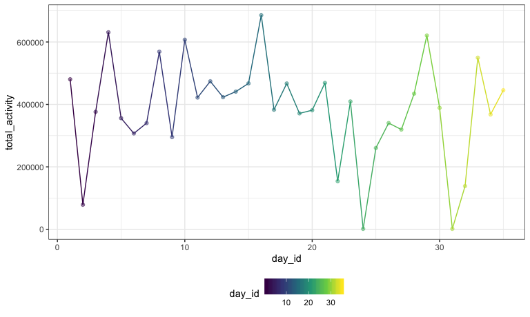
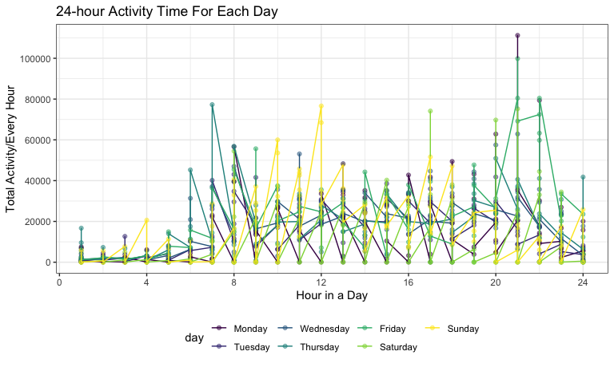

p8105\_hw3\_rw2708
================
Ran Wang
10/7/2019

\#Problem 1

``` r
instacart <- instacart %>% 
 #reorder the variables 
 select(user_id, order_id, order_number, product_id, product_name, order_dow, everything())

instacart
## # A tibble: 1,384,617 x 15
##    user_id order_id order_number product_id product_name order_dow
##      <int>    <int>        <int>      <int> <chr>            <int>
##  1  112108        1            4      49302 Bulgarian Y…         4
##  2  112108        1            4      11109 Organic 4% …         4
##  3  112108        1            4      10246 Organic Cel…         4
##  4  112108        1            4      49683 Cucumber Ki…         4
##  5  112108        1            4      43633 Lightly Smo…         4
##  6  112108        1            4      13176 Bag of Orga…         4
##  7  112108        1            4      47209 Organic Has…         4
##  8  112108        1            4      22035 Organic Who…         4
##  9   79431       36           23      39612 Grated Peco…         6
## 10   79431       36           23      19660 Spring Water         6
## # … with 1,384,607 more rows, and 9 more variables:
## #   add_to_cart_order <int>, reordered <int>, eval_set <chr>,
## #   order_hour_of_day <int>, days_since_prior_order <int>, aisle_id <int>,
## #   department_id <int>, aisle <chr>, department <chr>
```

Description: the dataset contains the online grocery purchase
information for instacart. The dataset has 1384617 of observations and
15 of variables. The variable names are user\_id, order\_id,
order\_number, product\_id, product\_name, order\_dow,
add\_to\_cart\_order, reordered, eval\_set, order\_hour\_of\_day,
days\_since\_prior\_order, aisle\_id, department\_id, aisle, department.
The key variables in this dataset are user\_id, order\_id that identify
each customer and their order id, order\_number, product\_id,
product\_name indicate the quantity and name of products that each
customer purchased. The variable order\_dow indicates the day of the
week on which the order was placed, and the variable
order\_hour\_of\_day suggests the hour of the day on which the order was
placed. For example, the first observation an user with id number 112108
who purchased a Bulgarian Yogurt from the aisle Yogurt with the aisle id
120, at the hour of 10 on day 4 (Thursday).

``` r
#count the number of items in each aisle
 count_aisle <- instacart %>%
  group_by(aisle) %>% 
  distinct() %>% 
  summarize(count_aisle = n()) %>% 
  arrange(desc(count_aisle))

 count_aisle
```

    ## # A tibble: 134 x 2
    ##    aisle                         count_aisle
    ##    <chr>                               <int>
    ##  1 fresh vegetables                   150609
    ##  2 fresh fruits                       150473
    ##  3 packaged vegetables fruits          78493
    ##  4 yogurt                              55240
    ##  5 packaged cheese                     41699
    ##  6 water seltzer sparkling water       36617
    ##  7 milk                                32644
    ##  8 chips pretzels                      31269
    ##  9 soy lactosefree                     26240
    ## 10 bread                               23635
    ## # … with 124 more rows

There are 134 aisles and the fresh vegetables are the are the most items
ordered from.

``` r
#generate the dataframe for plotting
plot_aisle = count_aisle %>% 
  filter(count_aisle > 10000) %>% 
  arrange(count_aisle) %>% 
  #change the order level of aisle according to the value of count_aisle 
  mutate(aisle = forcats::fct_reorder(aisle, count_aisle)) %>% 
  #Make a plot shows the number of items ordered in each aisle
  ggplot(aes(x = aisle, y = count_aisle)) +
  geom_col(aes(fill = aisle)) +
   labs(title = " The number of items ordered in each aisle",
        x = "aisle name", 
        y = "counts of items"
        ) %>% 
   scale_x_discrete(labels = NULL)

plot_aisle
```


The graph intended to show the increase in number of items ordered in
each aisle. We can clearly see that Fresh vegetables and Fresh Fruits
are more popular than other
items.

``` r
#Make a table showing the three most popular items in each of the aisles “baking ingredients”, “dog food care”, and “packaged vegetables fruits”
table_1 =  
  instacart %>% 
  arrange(aisle_id, aisle) %>% 
  filter(aisle == "baking ingredients" | aisle == "dog food care" | aisle == "packaged vegetables fruits") %>% 
  #count the number of times each item is ordered in these three aisles
  group_by(aisle,product_name) %>% 
  summarize(count = n()) %>% 
  #rank the number of times each item is ordered in these three aisles
  mutate(pop_rank = min_rank(desc(count))) %>% 
  #keep three most popular items in each of the aisles 
  filter(pop_rank < 4) %>% 
  arrange(desc(count)) %>%
  rename("number_of_times"=count) %>% 
  knitr::kable(digits = 1)

table_1
```

| aisle                      | product\_name                                 | number\_of\_times | pop\_rank |
| :------------------------- | :-------------------------------------------- | ----------------: | --------: |
| packaged vegetables fruits | Organic Baby Spinach                          |              9784 |         1 |
| packaged vegetables fruits | Organic Raspberries                           |              5546 |         2 |
| packaged vegetables fruits | Organic Blueberries                           |              4966 |         3 |
| baking ingredients         | Light Brown Sugar                             |               499 |         1 |
| baking ingredients         | Pure Baking Soda                              |               387 |         2 |
| baking ingredients         | Cane Sugar                                    |               336 |         3 |
| dog food care              | Snack Sticks Chicken & Rice Recipe Dog Treats |                30 |         1 |
| dog food care              | Organix Chicken & Brown Rice Recipe           |                28 |         2 |
| dog food care              | Small Dog Biscuits                            |                26 |         3 |

``` r
table_2 =  
  instacart %>% 
  arrange(product_name,order_hour_of_day,order_dow) %>% 
  filter(product_name == "Pink Lady Apples"| product_name == "Coffee Ice Cream") %>%
  #calculate the mean hour of the day on each day of the week for the above two products
  group_by(product_name,order_dow) %>% 
  summarize(mean_day = mean(order_hour_of_day)) %>% 
  #produce a 2 x 7 table
  pivot_wider(
    id_cols = "product_name",
  names_from = "order_dow", 
  values_from = "mean_day") %>% 
  rename(Sunday = "0", Monday = "1", Tuesday = "2", Wednesday = "3", Thursday = "4", Friday = "5", Saturday = "6") %>% 
  knitr::kable(digits = 1)
 
table_2 
```

| product\_name    | Sunday | Monday | Tuesday | Wednesday | Thursday | Friday | Saturday |
| :--------------- | -----: | -----: | ------: | --------: | -------: | -----: | -------: |
| Coffee Ice Cream |   13.8 |   14.3 |    15.4 |      15.3 |     15.2 |   12.3 |     13.8 |
| Pink Lady Apples |   13.4 |   11.4 |    11.7 |      14.2 |     11.6 |   12.8 |     11.9 |

\#Problem 2

``` r
data("brfss_smart2010")
brfss_clean <- brfss_smart2010 %>%
  #format the data to use appropriate variable names;
  janitor::clean_names () %>%
  rename("state" = locationabbr,"location" = locationdesc,"resp_id" = respid) %>% 
  #focus on the “Overall Health” topic
  filter(topic == "Overall Health") %>% 
  #include only responses from “Excellent” to “Poor”
  arrange(response) %>% 
  filter(response == "Excellent" |
           response == "Very good" | 
           response == "Good" |
           response == "Fair" |
           response == "Poor") %>% 
  #organize responses as a factor taking levels ordered from “Poor” to “Excellent”
  mutate(response = forcats::fct_relevel(response, c("Poor","Fair","Good","Very good","Excellent")))

brfss_clean
```

    ## # A tibble: 10,625 x 23
    ##     year state location class topic question response sample_size
    ##    <int> <chr> <chr>    <chr> <chr> <chr>    <fct>          <int>
    ##  1  2010 AL    AL - Je… Heal… Over… How is … Excelle…          94
    ##  2  2010 AL    AL - Mo… Heal… Over… How is … Excelle…          91
    ##  3  2010 AL    AL - Tu… Heal… Over… How is … Excelle…          58
    ##  4  2010 AZ    AZ - Ma… Heal… Over… How is … Excelle…         269
    ##  5  2010 AZ    AZ - Pi… Heal… Over… How is … Excelle…          68
    ##  6  2010 AZ    AZ - Pi… Heal… Over… How is … Excelle…         133
    ##  7  2010 AR    AR - Be… Heal… Over… How is … Excelle…          67
    ##  8  2010 AR    AR - Pu… Heal… Over… How is … Excelle…         100
    ##  9  2010 AR    AR - Wa… Heal… Over… How is … Excelle…          47
    ## 10  2010 CA    CA - Al… Heal… Over… How is … Excelle…         167
    ## # … with 10,615 more rows, and 15 more variables: data_value <dbl>,
    ## #   confidence_limit_low <dbl>, confidence_limit_high <dbl>,
    ## #   display_order <int>, data_value_unit <chr>, data_value_type <chr>,
    ## #   data_value_footnote_symbol <chr>, data_value_footnote <chr>,
    ## #   data_source <chr>, class_id <chr>, topic_id <chr>, location_id <chr>,
    ## #   question_id <chr>, resp_id <chr>, geo_location <chr>

``` r
#question1 2002 data
state_2002 = brfss_clean %>% 
  filter(year == "2002") %>% 
  group_by(state) %>% 
  arrange(state) %>% 
  distinct(location) %>% 
  summarize(count = n()) %>% 
  filter(count >= 7) %>% 
  arrange(desc(count))

state_2002
```

    ## # A tibble: 6 x 2
    ##   state count
    ##   <chr> <int>
    ## 1 PA       10
    ## 2 MA        8
    ## 3 NJ        8
    ## 4 CT        7
    ## 5 FL        7
    ## 6 NC        7

``` r
#question1 2010 data
state_2010 = brfss_clean %>% 
  filter(year == "2010") %>% 
  group_by(state) %>% 
  arrange(state) %>% 
  distinct(location) %>%
  summarize(count = n()) %>% 
  filter(count >= 7) %>% 
  arrange(desc(count))

state_2010
```

    ## # A tibble: 14 x 2
    ##    state count
    ##    <chr> <int>
    ##  1 FL       41
    ##  2 NJ       19
    ##  3 TX       16
    ##  4 CA       12
    ##  5 MD       12
    ##  6 NC       12
    ##  7 NE       10
    ##  8 WA       10
    ##  9 MA        9
    ## 10 NY        9
    ## 11 OH        8
    ## 12 CO        7
    ## 13 PA        7
    ## 14 SC        7

In 2002, there were 6 states where 7 or more locations are observed,
namely Pennsylvania, Massachusetts, New Jersey, Connecticut, Florida,
and North Carolina.

In 2010, there were 14 states where 7 or more locations are observed,
namely Florida, New Jersey, Texas, California, Maryland, North Carolina,
Nebraska, Washington, Massachusetts, New York, Ohio,Colorado,
Pannsylvania, South Carolina.

``` r
#generate the dataframe for plotting
excellent_data = brfss_clean %>%
  filter(response == "Excellent") %>% 
  select(year,state,location,data_value) %>% 
  #create a variable that averages the data_value across locations within a state.
  group_by(state,year) %>% 
  summarize(avg = mean(data_value,na.rm = TRUE))

excellent_data
```

    ## # A tibble: 443 x 3
    ## # Groups:   state [51]
    ##    state  year   avg
    ##    <chr> <int> <dbl>
    ##  1 AK     2002  27.9
    ##  2 AK     2003  24.8
    ##  3 AK     2004  23.0
    ##  4 AK     2005  23.8
    ##  5 AK     2007  23.5
    ##  6 AK     2008  20.6
    ##  7 AK     2009  23.2
    ##  8 AL     2002  18.5
    ##  9 AL     2003  19.5
    ## 10 AL     2004  20  
    ## # … with 433 more rows

``` r
#Make a “spaghetti” plot of this average value over time within a state 
plot_excellent = excellent_data %>% 
  ggplot(aes(x = year, y = avg)) + 
  geom_line(aes(color = state)) +
   labs(
    title = "Spaghetti Plot for Average Value Over Time Across Locations Within a State",
    x = "Year",
    y = "Average data value over time across locations within a state"
  ) 

plot_excellent
```


As we can seen from the spaghetti plot, the average data value among
excellent responses across locations within a state from 2002 to 2010 is
stable for most states, with one exception of West Virginia state where
the figure fluctuated greatly and was reletively lower than other
states.

``` r
data_penal <- brfss_clean %>% 
  #keep data of NY in 2006 and 2010
  filter(year == 2006 | year == 2010) %>% 
  filter(state == "NY") %>% 
  drop_na(data_value) %>% 
  #make a density plot for distribution of data_value for responses in NY fro 2006 and 2010
  group_by(response) %>% 
  ggplot(aes(x = data_value, fill = response)) + 
  geom_density(alpha = .5, adjust=1, color = "blue") +
  facet_grid(year~response) +
   labs(
    title = "Two-Panel Plot of Data Value for Responses in NY State (2006 and 2010)",
    x = "Data Value",
    y = "Density"
  )

data_penal
```


Generally speaking, the Data Value for Responses at every level for 2006
and 2010 looks similar. There is a slight difference of the Fair
responses, the 2010 has more Fair responses than that in 2006.

\#Problem3

``` r
P3_data = read_csv(file = "./hw3data/accel_data.csv") %>% 
  #useful variable names
  janitor::clean_names () %>% 
  #tidy the data 
   pivot_longer(
   activity_1:activity_1440,
    names_to = "minute_daily",
    names_prefix = "activity_",
    values_to = "activity_counts") %>% 
  #encode data with reasonable variable classes
   mutate(day_temporary = recode(day, "Monday" = "1" ,"Tuesday" =  "2", "Wednesday" = "3", "Thursday" = "4", "Friday" = "5", "Saturday" = "6", "Sunday" = "7")) %>%
    #include a weekday vs weekend variable
    mutate(weekday_weekend = case_when(
      day_temporary <= 5 ~ "weekday",
      day_temporary > 5 ~ "weekend",
      TRUE    ~ "")) %>% 
   select(-day_temporary)
```

    ## Parsed with column specification:
    ## cols(
    ##   .default = col_double(),
    ##   day = col_character()
    ## )

    ## See spec(...) for full column specifications.

``` r
P3_data 
```

    ## # A tibble: 50,400 x 6
    ##     week day_id day    minute_daily activity_counts weekday_weekend
    ##    <dbl>  <dbl> <chr>  <chr>                  <dbl> <chr>          
    ##  1     1      1 Friday 1                       88.4 weekday        
    ##  2     1      1 Friday 2                       82.2 weekday        
    ##  3     1      1 Friday 3                       64.4 weekday        
    ##  4     1      1 Friday 4                       70.0 weekday        
    ##  5     1      1 Friday 5                       75.0 weekday        
    ##  6     1      1 Friday 6                       66.3 weekday        
    ##  7     1      1 Friday 7                       53.8 weekday        
    ##  8     1      1 Friday 8                       47.8 weekday        
    ##  9     1      1 Friday 9                       55.5 weekday        
    ## 10     1      1 Friday 10                      43.0 weekday        
    ## # … with 50,390 more rows

The dataset uses five weeks of accelerometer data collected on a 63
year-old male with BMI 25, who was admitted to the Advanced Cardiac Care
Center of CUMC and diagnosed with congestive heart failure (CHF). The
dataset contains 50400 observations and six variables, namely week,
day\_id, day, minute\_daily, activity\_counts, weekday\_weekend.

The first variable week identifies the week when the accelerometer data
was collected.

The second and third variable day\_id, day identifies the day and the
day of week when the accelerometer data was collected.

The variables minute\_daily, activity\_counts identify the activity
counts in each minute of this 63 year-old male.

The variables \`r colnames(P3\_data)\[6\] indicates whether the day is a
weekday or a weekend when the accelerometer data was collected.

``` r
# create a table showing a total activity variable for each day
analysis_activity = P3_data %>% 
  group_by(week,day_id) %>% 
  summarise(total_activity = sum(activity_counts))

 knitr::kable(analysis_activity,digits = 2)
```

| week | day\_id | total\_activity |
| ---: | ------: | --------------: |
|    1 |       1 |       480542.62 |
|    1 |       2 |        78828.07 |
|    1 |       3 |       376254.00 |
|    1 |       4 |       631105.00 |
|    1 |       5 |       355923.64 |
|    1 |       6 |       307094.24 |
|    1 |       7 |       340115.01 |
|    2 |       8 |       568839.00 |
|    2 |       9 |       295431.00 |
|    2 |      10 |       607175.00 |
|    2 |      11 |       422018.00 |
|    2 |      12 |       474048.00 |
|    2 |      13 |       423245.00 |
|    2 |      14 |       440962.00 |
|    3 |      15 |       467420.00 |
|    3 |      16 |       685910.00 |
|    3 |      17 |       382928.00 |
|    3 |      18 |       467052.00 |
|    3 |      19 |       371230.00 |
|    3 |      20 |       381507.00 |
|    3 |      21 |       468869.00 |
|    4 |      22 |       154049.00 |
|    4 |      23 |       409450.00 |
|    4 |      24 |         1440.00 |
|    4 |      25 |       260617.00 |
|    4 |      26 |       340291.00 |
|    4 |      27 |       319568.00 |
|    4 |      28 |       434460.00 |
|    5 |      29 |       620860.00 |
|    5 |      30 |       389080.00 |
|    5 |      31 |         1440.00 |
|    5 |      32 |       138421.00 |
|    5 |      33 |       549658.00 |
|    5 |      34 |       367824.00 |
|    5 |      35 |       445366.00 |

``` r
#exploring the trend
trend_activity = analysis_activity %>% 
  mutate(day = day_id) %>% 
  ggplot(aes(x = day, y = total_activity)) +
  geom_point(aes(color = day), alpha = 0.5) +
  geom_line(aes(color = day)) +
  scale_y_continuous(
    # alteration for y-axis labels
    breaks = c(0, 200000, 400000, 600000),
    labels = c("0", "200000", "400000", "600000")
  ) 


trend_activity
```



There is no clear trend of a total activity variable for each day since
the total activity fluctuate greatly across the day.

``` r
day_week = P3_data  %>% 
  #converting minute_daily from character to numeric
  mutate(minute_daily = as.numeric(minute_daily)) %>% 
  #converting day to a factor with different levels (might be good visually for plotting)
  mutate(day = forcats::fct_relevel(day, c("Monday","Tuesday","Wednesday","Thursday","Friday","Saturday","Sunday"))) %>% 
  arrange(day) %>%
  #converting minute to hour
  group_by(day) %>% 
  mutate(hour_daily = ceiling(minute_daily/60)) %>% 
  # calculate the total activity for each hour in each day
  group_by(day, hour_daily) %>% 
  summarize(hour_activity = sum(activity_counts)) %>% 
  #Make a single-panel plot that shows the 24-hour activity time courses for each day
  ggplot(aes(x = hour_daily, y = hour_activity)) +
  geom_point(aes(color = day), alpha = 0.5) +
  geom_line(aes(color = day)) +
   labs(
    title = "24-hour Activity Time For Each Day",
    x = "Hour in a Day",
    y = "Total Activity/Every Hour"
    ) +
    scale_x_continuous(
    # alteration for x-axis labels 
    breaks = c(0, 4, 8, 12, 16, 20, 24),
    labels = c("0", "4", "8", "12", "16", "20", "24")) +
   scale_y_continuous(
    # alteration for y-axis labels
    breaks = c(0, 50000, 100000, 150000, 200000, 250000, 300000),
    labels = c("0", "50000", "100000", "150000", "200000","250000", "300000")
  ) 

day_week
```


As shown in the above graph, this man has similar of 24-hour activity
pattern in every day of the week. For example, he has low activity
during the 6am in a day. And his activity increases dramatically after
approximately 6am of a day. His activity remains relatively stable
between 6am and 20pm, then drops after 21pm.
